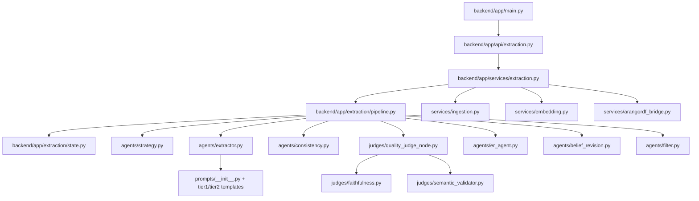
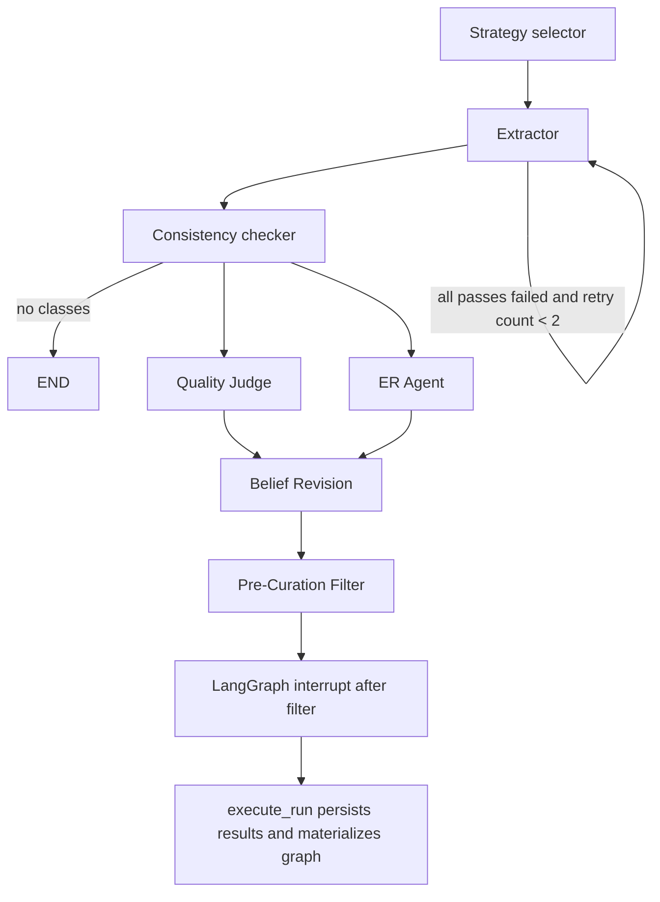

# LangGraph Code Analysis of arango-ontoextract

## Executive summary

The LangGraph implementation in `arango-ontoextract` is centered on a single `StateGraph` defined in `backend/app/extraction/pipeline.py`. The actual code-level DAG is **Strategy → Extractor → Consistency → parallel fork to Quality Judge and ER → Belief Revision → Filter**, with a retry loop on extraction failures and a checkpointed interrupt after the filter stage. The public HTTP entry point is `POST /api/v1/extraction/run`, which creates an `extraction_runs` record and schedules `services.extraction.execute_run()` as a FastAPI background task. That service loads document chunks, optionally serializes Tier‑2 domain context, calls `run_pipeline()`, persists run stats/results, and then materializes the post-filter ontology into ArangoDB graph collections. citeturn17view0turn17view1turn20view6turn20view7turn28view0

The prompt system is intentionally simple and registry-based. `strategy_selector_node()` chooses `tier1_standard`, `tier1_technical`, or `tier2_standard`; `extractor_node()` renders the selected template with `chunks_text`, `domain_context`, `pass_number`, and `model_name`; then it invokes either `ChatAnthropic` or `ChatOpenAI` asynchronously through LangChain. The extractor runs **all passes concurrently** and each pass runs **all chunk batches concurrently**, with a retry loop that appends a validation-failure repair message back into the conversation when a batch response fails JSON parsing or model validation. citeturn17view2turn17view3turn20view2turn20view3turn20view4turn26view0turn24view0turn21view5

Several implementation details are analytically important. First, the code and the docs are not perfectly aligned: the architecture docs still depict older orderings, while the runtime DAG now forks Quality Judge and ER in parallel and includes a Belief Revision join stage. Second, the filter stage’s `_annotate_confidence_tiers()` and `_add_provenance()` are currently no-ops, so the stage computes filter statistics but does not actually mutate class objects for those two concerns. Third, the documented staging→curation→promotion flow is not obvious in the inspected backend path: after `run_pipeline()` pauses at the post-filter breakpoint, `execute_run()` still persists `consistency_result` and materializes it into ontology collections. That looks like a production write path rather than a separate staging graph path, although related curation modules may exist elsewhere in the repo. Fourth, the extractor’s “RAG” helper currently uses the **first chunk’s embedding** as the query vector, not a batch-specific embedding derived from `batch_text`, so retrieval is relatively coarse. citeturn17view0turn17view7turn20view7turn21view6turn21view8

The persistence layer is substantial. The extraction service writes run metadata into `extraction_runs`, stores full extraction payloads under `results_{run_id}`, auto-registers or updates an ontology registry entry, and materializes classes and properties into PGT-style collections such as `ontology_classes`, `ontology_datatype_properties`, `ontology_object_properties`, plus edges like `rdfs_domain`, `rdfs_range_class`, `subclass_of`, `extracted_from`, `has_chunk`, and `produced_by`. Nearby, `arangordf_bridge.py` imports external OWL/RDF into the same ArangoDB graph model through `arango_rdf` when present, with an rdflib fallback and post-processing that synchronizes `owl:imports` into `imports` edges between registry documents. citeturn20view7turn20view9turn21view2

The repository also now has a real CI workflow. The older work-plan document still says CI was missing, but the current `.github/workflows/ci.yml` runs lint, pre-commit, backend unit tests with coverage gates, integration tests with ArangoDB and Redis service containers, backend E2E tests, frontend tests, and a final unified Docker smoke test including a WebSocket handshake regression check. citeturn15view0turn21view4turn21view8

## Repository map

The LangGraph-related code lives under `backend/app/extraction/`, with adjacent orchestration entry points in `backend/app/api/`, `backend/app/services/`, `backend/app/main.py`, `backend/app/db/`, and `backend/app/models/`. The architecture docs describe this split explicitly: API routes handle HTTP, services own orchestration/business logic, DB repositories encapsulate AQL, and `backend/app/extraction/` contains the LangGraph agents, LLM calls, and prompt templates. citeturn7view0turn8view0turn8view1turn9view0turn10view0turn21view6

### Enumerated LangGraph-related files

The current tree under the extraction package, based on the repo’s directory listings, is as follows. I include `AGENTS.md` and `__init__.py` files because the user requested full enumeration under the LangGraph-related directories. citeturn7view0turn8view0turn8view1turn9view0turn10view0

| Directory | Files |
|---|---|
| `backend/app/extraction/` | `AGENTS.md`, `__init__.py`, `pipeline.py`, `state.py` |
| `backend/app/extraction/agents/` | `__init__.py`, `belief_revision.py`, `consistency.py`, `er_agent.py`, `extractor.py`, `filter.py`, `strategy.py` |
| `backend/app/extraction/judges/` | `__init__.py`, `faithfulness.py`, `qualitative_eval_node.py`, `quality_judge_node.py`, `semantic_validator.py` |
| `backend/app/extraction/prompts/` | `__init__.py`, `tier1_standard.py`, `tier1_technical.py` |
| `backend/app/extraction/prompts/tier2/` | `__init__.py`, `tier2_standard.py` |

### Module map

The table below maps the principal modules, their purpose, core symbols, and the most important local line ranges from the inspected working copy.

| Module | Purpose | Key functions/classes | Call graph summary | Important local refs | Source |
|---|---|---|---|---|---|
| `backend/app/extraction/pipeline.py` | Defines the LangGraph DAG, checkpointer, streaming execution, and WebSocket-style step events | `build_pipeline`, `compile_pipeline`, `run_pipeline` | Called by `services/extraction.execute_run`; calls all agent nodes | `73–136`, `139–172`, `175–335` | citeturn17view0turn18view0 |
| `backend/app/extraction/state.py` | Typed pipeline state with LangGraph reducers for parallel merge | `ExtractionPipelineState`, `StepLog`, `StrategyConfig` | Read/write contract for every node | `38–89` | citeturn17view1 |
| `backend/app/extraction/agents/strategy.py` | Heuristic strategy selection and Tier‑2 template override | `_classify_document`, `strategy_selector_node` | Called by pipeline entry node; chooses prompt + pass/batch policy | `17–49`, `53–81`, `84–139` | citeturn17view2 |
| `backend/app/extraction/agents/extractor.py` | N-pass LLM extraction, prompt rendering, retries, and coarse vector-context augmentation | `_get_llm`, `_batch_chunks`, `_retrieve_relevant_chunks`, `_extract_batch`, `_run_single_pass`, `extractor_node` | Called by pipeline; calls LangChain chat models and prompt registry | `29–58`, `61–71`, `130–166`, `169–251`, `315–409` | citeturn17view3turn24view0 |
| `backend/app/extraction/agents/consistency.py` | Cross-pass agreement filter and merge logic | `_merge_*`, `_convert_properties_to_pgt`, `consistency_checker_node` | Called by pipeline after extraction; feeds Quality Judge and ER | `71–150`, `153–189`, `192–364` | citeturn17view4 |
| `backend/app/extraction/judges/quality_judge_node.py` | Runs faithfulness and semantic validity in parallel and writes scores back into classes | `quality_judge_node` | Called by pipeline; calls `judge_faithfulness`, `validate_semantics` | `23–124` | citeturn17view8 |
| `backend/app/extraction/judges/faithfulness.py` | LLM grounding judge against source text | `_build_user_prompt`, `_parse_response`, `judge_faithfulness` | Called by `quality_judge_node`; one LLM call for all classes | `31–40`, `43–55`, `84–129` | citeturn17view9 |
| `backend/app/extraction/judges/semantic_validator.py` | LLM OWL/shape plausibility judge | `_class_fields_for_validation`, `_build_user_prompt`, `_parse_response`, `validate_semantics` | Called by `quality_judge_node`; one LLM call for all classes | `24–40`, `43–108`, `136–175` | citeturn20view1 |
| `backend/app/extraction/agents/er_agent.py` | Entity resolution wrapper over existing ontology classes and cross-tier edge creation | `er_agent_node`, `_run_er_matching`, `_create_extension_edges` | Called by pipeline in parallel with Quality Judge | `20–91`, `94–160`, `163–187` | citeturn17view6turn24view0 |
| `backend/app/extraction/agents/belief_revision.py` | Four-phase revision stage, feature-gated, with mechanical + LLM phases | `belief_revision_node`, `_run_phase`, `_invoke_llm_for_contested` | Join after QJ and ER; writes `revision_actions` and summary | `91–197`, `205–335`, `391–407` | citeturn17view5turn21view8 |
| `backend/app/extraction/agents/filter.py` | Pre-curation filtering plus revision summary packaging | `filter_agent_node`, `_remove_*`, `_summarise_revision_actions` | Final pipeline node before interrupt/end | `57–142`, `150–214`, `222–245`, `261–329` | citeturn17view7 |
| `backend/app/extraction/prompts/__init__.py` | Prompt registry and render mechanism | `PromptTemplate`, `register_template`, `get_template` | Called by extractor | Registry/render implementation | citeturn26view0 |
| `backend/app/extraction/prompts/tier1_standard.py` | General-domain extraction template | `_SYSTEM`, `_USER`, `_TEMPLATE` | Loaded lazily by prompt registry | Prompt schema + guidelines | citeturn20view2 |
| `backend/app/extraction/prompts/tier1_technical.py` | Technical/standards extraction template | `_SYSTEM`, `_USER`, `_TEMPLATE` | Loaded lazily by prompt registry | Prompt schema + standards emphasis | citeturn20view3 |
| `backend/app/extraction/prompts/tier2/tier2_standard.py` | Context-aware extension/classification template | `_SYSTEM`, `_USER`, `_TEMPLATE` | Loaded lazily by prompt registry; selected when `domain_context` exists | Adds `existing|extension|new` semantics | citeturn20view4 |
| `backend/app/services/extraction.py` | Run lifecycle orchestration, persistence, graph materialization, background qualitative eval | `create_run_record`, `execute_run`, `_store_results`, `_materialize_to_graph`, `_auto_register_ontology` | Called by API router/background tasks; calls pipeline and persistence helpers | `52–118`, `140–380`, `383–421`, `677–699`, `780–1158`, `1346–1465` | citeturn20view7 |
| `backend/app/services/arangordf_bridge.py` | External OWL/RDF import into ArangoDB PGT model | `import_owl_to_graph`, `sync_owl_imports_edges`, `import_from_file`, `import_from_url` | Adjacent persistence/import path | `43–116`, `148–220`, `631–789` | citeturn20view9 |
| `backend/app/api/extraction.py` | HTTP entry points for run creation/read/retry/delete | `start_extraction`, `list_runs`, `get_run*`, `retry_run` | Called by FastAPI main app; calls extraction service | `20–40`, `56–96`, `140–292` | citeturn20view6turn25view2 |
| `backend/app/main.py` | FastAPI application construction and router mounting | `app = FastAPI(...)`, `include_router(...)` | Main process entry point | Router mounting and middleware setup | citeturn28view0 |

## Orchestration and data flow

The runtime orchestration is materially more sophisticated than a simple linear chain because the state object is explicitly designed to support parallel branches. In `ExtractionPipelineState`, `errors`, `step_logs`, and `revision_actions` use `Annotated[..., operator.add]`, which is exactly what allows the `quality_judge` and `er_agent` branches to fan out and then merge back into the same LangGraph state without collision. That is a real code-level LangGraph design decision, not just documentation. citeturn17view1turn17view0

The entry path is straightforward. `backend/app/main.py` mounts `extraction.router`, so the user-visible entry point is the FastAPI route in `backend/app/api/extraction.py`. `start_extraction()` normalizes `document_id` / `document_ids`, validates that referenced documents exist and are `ready`, creates the run record through `create_run_record()`, and schedules `execute_run()` as a background task using FastAPI’s `BackgroundTasks`. This means the HTTP request returns quickly while the LangGraph run proceeds asynchronously. citeturn28view0turn20view6

`execute_run()` then performs the real orchestration: it loads the run record, resolves Tier‑2 ontology IDs into a serialized `domain_context`, loads all document chunks from the `chunks` collection, calls `run_pipeline()`, updates run stats, and persists outputs. If a `consistency_result` exists, it stores that result document, either updates an existing ontology or auto-registers a new one, and calls `_materialize_to_graph()` to write the extracted ontology into ArangoDB collections. It also spawns a fire-and-forget qualitative evaluation task after the graph write. citeturn20view7

The most important control-flow fact is that `run_pipeline()` always compiles with `interrupt_after_filter=True`, and emits a `pipeline_paused` event when the graph is interrupted after the filter step. The API docs also describe `pipeline_paused` as a real extraction WebSocket event. However, in the inspected backend path, `execute_run()` still persists and materializes the pipeline result immediately after `run_pipeline()` returns. I therefore infer that the currently inspected backend writes filtered results into the main ontology collections even when the LangGraph layer says “paused after pre-curation filter.” The architecture docs, by contrast, still describe an intermediate staging graph followed by curation and promotion. That discrepancy is one of the most important findings in this review. citeturn17view0turn20view7turn21view7turn21view6

### Stage-by-stage data flow

| Stage | Input state keys | Output state keys | Runtime style | Main behavior | Failure or skip behavior | Source |
|---|---|---|---|---|---|---|
| Strategy | `document_chunks`, `domain_context` | `strategy_config`, `step_logs` | synchronous node | Heuristic doc classification; swaps to `tier2_standard` if Tier‑2 context exists | No explicit failure path beyond missing chunks; logs completed step | citeturn17view2 |
| LLM extraction | `strategy_config`, `document_chunks`, `domain_context`, `errors` | `extraction_passes`, `token_usage`, `errors`, `step_logs` | async node; concurrent passes and concurrent batches | Renders prompt, calls LLM, retries invalid JSON, totals tokens | Retries each batch up to 5 times; pipeline retries whole extractor stage if no pass succeeded | citeturn17view3turn17view0 |
| Consistency | `extraction_passes`, `strategy_config`, `errors` | `consistency_result`, `step_logs` | synchronous node | Keeps classes meeting agreement threshold; merges evidence/properties | Returns failed step + `consistency_result=None` when no passes available | citeturn17view4 |
| Quality Judge | `consistency_result`, `document_chunks`, `strategy_config` | updated `consistency_result`, `faithfulness_scores`, `validity_scores`, `step_logs` | async node; runs two judges with `asyncio.gather` | Computes grounding and semantic scores for all classes | Skips if no consistency result; judges individually fall back to defaults on exception | citeturn17view8turn17view9turn20view1 |
| Entity Resolution | `consistency_result`, `metadata.ontology_id`, `errors` | `er_results`, `merge_candidates`, `errors`, `step_logs` | synchronous node | Matches extracted classes against existing classes; optionally creates cross-tier edges | Skips if no extraction result; catches exceptions and marks ER failed | citeturn17view6turn24view0 |
| Belief Revision | `consistency_result`, `metadata.ontology_id`, `document_id`, `domain_context` | `revision_actions`, `belief_revision_summary`, `errors`, `step_logs` | synchronous wrapper with async LLM subphase | Discovers touchpoints, classifies mechanical revisions, escalates contested cases to LLM | Entire phase skipped behind feature flag or missing ontology/doc IDs; individual touchpoint failures become failed action records | citeturn17view5turn24view0 |
| Pre-Curation Filter | `consistency_result`, `revision_actions`, `document_id`, `run_id` | updated `consistency_result`, `filter_results`, `step_logs` | synchronous node | Removes generic/noisy terms and duplicate labels/URIs; assembles pending revision summary | Skips cleanly when no input results | citeturn17view7 |

### High-value code snippets

The following are the most central implementation snippets, referenced by exact file path and local line range from the inspected working copy.

**Pipeline topology and fork/join:** `backend/app/extraction/pipeline.py:73–136`

> The code builds a `StateGraph(ExtractionPipelineState)`, adds seven nodes, sets `strategy_selector` as entry, retries the extractor conditionally, forks from consistency to `["quality_judge", "er_agent"]`, then joins both into `belief_revision`, and finally routes `filter` to `END`. citeturn17view0

**Prompt construction and self-correction loop:** `backend/app/extraction/agents/extractor.py:189–214`

> `_extract_batch()` calls `template.render(chunks_text=batch_text, domain_context=domain_context, extra_vars={"pass_number": ..., "model_name": ...})`, builds `[SystemMessage(system_msg), HumanMessage(user_msg)]`, and, on a retry, appends a second `HumanMessage` asking the model to “fix the JSON.” citeturn17view3turn26view0

**Filter no-op annotations:** `backend/app/extraction/agents/filter.py:222–245`

> `_annotate_confidence_tiers()` currently returns `classes` unchanged, and `_add_provenance()` also returns `classes` unchanged. The filter stage therefore computes counts and summaries, but those two annotation hooks are placeholders in the current code. citeturn17view7

**Graph materialization target collections:** `backend/app/services/extraction.py:780–817`

> `_materialize_to_graph()` explicitly creates or reuses `ontology_classes`, `ontology_datatype_properties`, `ontology_object_properties`, and edges `rdfs_domain`, `rdfs_range_class`, `subclass_of`, `extracted_from`, `has_chunk`, and `produced_by` before inserting class/property documents and temporal edges. citeturn20view7

## Prompts and model stack

The prompt subsystem is implemented as a registry. `PromptTemplate.render()` formats `system_prompt` and `user_prompt` with `chunks_text`, `domain_context`, and arbitrary `extra_vars`; `get_template()` lazy-loads the built-in templates `tier1_standard`, `tier1_technical`, and `tier2_standard`. That means prompt selection is strategy-driven rather than agent-specific: the extractor uses whatever template key the strategy node selected. citeturn26view0turn17view2turn17view3

The three built-in extraction templates all require a structured JSON ontology response, but they differ in emphasis. `tier1_standard` is the default general-domain prompt; `tier1_technical` emphasizes taxonomic depth, standards language, and constraints; `tier2_standard` injects domain ontology context and requires each extracted class to be classified relative to that domain as `existing`, `extension`, or `new`. All three prompts require explicit class metadata, separate `attributes` and `relationships`, and source evidence objects keyed by source chunk IDs. citeturn20view2turn20view3turn20view4

Because the user asked to reproduce the “key prompt templates,” the most accurate short summary is this:

| Prompt | What it tells the model to do | Distinctive schema or rule | Local file |
|---|---|---|---|
| `tier1_standard` | Extract a formal OWL ontology from general text chunks | Requires `classes[]`, `parent_uri`, `attributes[]`, `relationships[]`, evidence arrays, `pass_number`, and `model` | `backend/app/extraction/prompts/tier1_standard.py:5–125` |
| `tier1_technical` | Extract a precise OWL taxonomy from technical standards/specifications | Same broad schema, but with stronger instructions for deep hierarchies, technical definitions, and standards phrasing | `backend/app/extraction/prompts/tier1_technical.py:5–116` |
| `tier2_standard` | Extract a localized ontology extension against existing domain context | Adds `parent_domain_uri` and requires `classification` as `existing | extension | new` | `backend/app/extraction/prompts/tier2/tier2_standard.py:9–142` |

The route from prompt text to model invocation is simple but important. The extractor first combines chunks into batched text blocks with explicit chunk headers. It then optionally appends a `--- RELATED CONTEXT ---` block built from vector-retrieved chunks. Finally, it renders the chosen prompt and sends a LangChain message list to `llm.ainvoke(...)`. `faithfulness.py` and `semantic_validator.py` repeat the same pattern, but each judge sends **all classes in one call** instead of batching per class. `qualitative_eval_node.py` adds a different pattern: it tries `with_structured_output(schema)` first, and falls back to plain `ainvoke()` plus JSON parsing if structured output is unavailable. citeturn17view3turn17view9turn20view1turn20view0

### Providers and configured models

The runtime provider logic is concentrated in `_get_llm()`. If the model name contains `"claude"` or `"anthropic"`, the code instantiates `langchain_anthropic.ChatAnthropic`; otherwise it instantiates `langchain_openai.ChatOpenAI`. Both paths apply `settings.llm_request_timeout_seconds`, and the OpenAI path also respects `settings.openai_base_url`. The config file sets `llm_extraction_model` to `claude-sonnet-4-20250514` by default and `embedding_model` to `text-embedding-3-small`; the embedding service uses `openai.AsyncOpenAI` directly. The dependency list in `backend/pyproject.toml` includes `langgraph`, `langchain-anthropic`, `langchain-openai`, `openai`, `rdflib`, and `arango-entity-resolution`. The extraction service also contains explicit token-cost rates for `claude-sonnet-4-20250514`, `claude-3-5-sonnet-20241022`, `gpt-4o`, and `gpt-4o-mini`. citeturn17view3turn23view0turn24view0turn21view5turn20view7

### Agent communication model

Communication between agents is entirely **state-passing** through LangGraph partial state updates. The synchronous nodes return dict fragments immediately; the asynchronous nodes return awaited dict fragments; the graph executor merges them using the declared reducers. Outside the graph, the extraction service communicates progress through an async `event_callback`, which defaults to the WebSocket publisher and emits `step_started`, `step_completed`, `pipeline_paused`, and `completed` events. The public API docs explicitly document `/ws/extraction/{run_id}` as the real-time pipeline progress channel. citeturn17view0turn17view1turn21view7

## Persistence and serialization

The extraction results are serialized twice: first as run artifacts, then as ontology graph data. Run artifacts live in the `extraction_runs` collection. `create_run_record()` inserts the initial run document with status, model, prompt version, and stats scaffolding. `_store_results()` then writes a second document in the same collection under key `results_{run_id}` containing the full serialized `extraction_result`. This is the service’s archival representation of the run. citeturn20view7

The graph serialization path is handled by `_materialize_to_graph()`. For each class in the final `consistency_result`, it writes an `ontology_classes` vertex with label, URI, ontology ID, extraction run ID, confidence, `faithfulness_score`, `semantic_validity_score`, evidence, and temporal `created`/`expired` fields. Attributes become `ontology_datatype_properties` vertices plus `rdfs_domain` edges. Relationships become `ontology_object_properties` vertices plus `rdfs_domain` edges and, when resolvable, `rdfs_range_class` edges. Subclass hierarchies are written into `subclass_of`, class-to-document provenance into `extracted_from`, document-to-chunk lineage into `has_chunk`, and ontology-to-run lineage into `produced_by`. Object-property range resolution explicitly preserves the raw LLM-provided `target_class_uri` and logs unresolved ranges so later repair can recover them. citeturn20view7

This graph write path appears to be **post-filter and post-quality-judge** rather than post-curation. That is because `quality_judge_node()` overwrites `consistency_result` with score-enriched classes, `filter_agent_node()` overwrites it again with filtered classes, and `execute_run()` persists `final_state["consistency_result"]`. In other words, the service persists the last graph-state version delivered by the pipeline, not the raw extractor or raw consistency output. citeturn17view8turn17view7turn20view7

The repo also contains a separate OWL/RDF import bridge. `import_owl_to_graph()` parses TTL into rdflib, imports via `arango_rdf.rdf_to_arangodb_by_pgt(...)` when available, or uses an rdflib fallback if `arango_rdf` is missing, then tags all created documents with `ontology_id` and ensures a named graph exists. `import_from_file()` and `import_from_url()` wrap that process with format detection, registry entry creation, and `owl:imports` synchronization into the `imports` edge collection. This is adjacent to, but distinct from, the LLM extraction serialization path. citeturn20view9turn21view2

### Adjacent storage path for ingestion and embeddings

Upstream of the LangGraph pipeline, ingestion chunks documents at section/paragraph boundaries while preserving page and section metadata, and the embedding service batches texts for `AsyncOpenAI.embeddings.create(...)` using token-aware batching and bounded concurrency. Downstream, the extractor’s retrieval helper expects precomputed chunk embeddings in the `chunks` collection, and queries ArangoDB with `COSINE_SIMILARITY(chunk.embedding, @embedding)` before appending the top related texts to the prompt. That makes the pipeline dependent on prior ingestion and embedding, even though the embedding generation itself is outside the LangGraph package. citeturn23view0turn20view8

## Tests, discrepancies, and limitations

The backend test tree clearly exists. The `backend/tests` directory contains `e2e`, `fixtures`, `integration`, and `unit` subdirectories, plus `AGENTS.md`, `__init__.py`, `conftest.py`, and `test_health.py`. The current CI workflow uses those directories directly: `pytest tests/unit/ -v --cov=app --cov-report=xml --cov-fail-under=80`, then `pytest tests/integration/ -v`, then `pytest tests/e2e/ -v --tb=short`. It also runs frontend lint/tests and a final unified Docker smoke test with a WebSocket handshake check. citeturn14view0turn21view4

A few technical discrepancies are worth calling out explicitly because they affect how one should read the repo. The architecture docs still show a simpler Strategy→Extraction→Consistency→Quality→ER→Pre-Curation pipeline and, later, a Belief Revision flow ordered as ER→Belief Revision→Quality Judge; the current `pipeline.py` instead executes Quality Judge and ER in parallel and joins them into Belief Revision. The docs also describe a staging graph followed by curation and promotion, whereas the inspected extraction service writes directly into ontology collections after the filter interrupt. Finally, the work plan still says CI was missing, but the repo now has a working CI workflow. These are the kinds of documentation drift that matter in architectural reviews. citeturn21view6turn17view0turn20view7turn21view8turn21view4

### Open questions and limitations

This report is based on the live GitHub code and a local working copy assembled from the relevant source files and directory listings. I did **not** inspect every adjacent module in depth. In particular, the exact internals of `app.services.er`, `app.services.cross_tier`, `app.services.revision_*`, `app.db.ontology_repo`, and the detailed Pydantic schema in `app.models.ontology` were only partially visible in this session, so some lower-level behaviors—especially the precise ER scoring logic, the full temporal revision semantics, and model validation details—remain unspecified here.

The highest-confidence unresolved technical question is the **curation/staging contract**. The code clearly emits a pipeline pause after the filter breakpoint, but the inspected orchestration service still persists and materializes results immediately afterward. Either there is a separate later curation gate elsewhere that was outside the inspected set, or the documented staging semantics are ahead of—or behind—the currently wired backend behavior. That ambiguity is in the repo, not in the analysis.