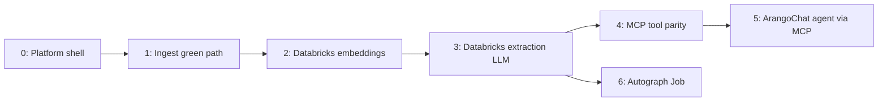

# Databricks migration plan — reassessment (2026-05-23)

Reassessed migration phases based on work completed to date, env naming tweaks, and Databricks free-tier embedding options.

---

## Where we are vs the original plan

| Original phase | Original goal | Status today |
|----------------|---------------|--------------|
| **A** — Prove deployed ingest/extract | Deploy chain + E2E upload → chunk → extract | **Partially done** — stack is deployed; ingest UX and ops improved, but E2E “green path” is not fully proven |
| **B** — Databricks LLM for LangGraph | Serving client + `_get_llm()` / embeddings | **In progress** — `app/llm/databricks_serving.py`, `AUTOGRAPH_*` env vars, wired in extractor/embedding/tasks |
| **C** — OPTIONAL: MCP tool parity | Named wrappers beyond 4 tools | **Partial** — 4 tools + `aoe_workflow_api` escape hatch only to suit needs of extraction agent's current REST calls |
| **D** — OPTIONAL: Allow LLM/user chat to initiate extraction processing steps using MCP tools (upload/parse/chunk/extract) via mcp-app | `ontoextract_mcp_orchestrator` | **Not started** |
| **E** — Autograph Job | Migrate LangGraph compute to `arango-agent-autograph-job` | **Planned** (README exists); no runnable job yet |

### Work completed since the first plan (material)

- **Control plane**: `arango-workflow-app` with full LangGraph under `src/app/extraction/`, gateway-only Arango, BFF `/api/workflow/ontoextract/v1/*`, UC registries, deploy path documented.
- **Ingest ops**: UC volume seeding (manifest v2), `ingest-from-volume`, builtin domains, ontology import-from-volume fixes.
- **UX / observability**: `/embedding` (Parse & Chunk), `LlmConnectivityBadge`, `GET /api/v1/system/llm-status`.
- **MCP**: `/mcp/aoe` HTTP bridge (4 tools) — correct architecture, thin surface.
- **MCP chat**: `genie_mcp_orchestrator.py` already uses workspace OAuth + `/serving-endpoints` (reference implementation for Autograph).

### Still true (unchanged gaps)

1. **Chunking does not depend on extraction LLM** — it depends on UC I/O, gateway/migrations, and **embeddings**. Moving extraction to Databricks first does not fix chunking.
2. **Embedding dimension is hardcoded to 1536** (`tasks.py` → Faiss vector index). Any Databricks embedding model at 1024 dims requires a deliberate re-embed + index rebuild.
3. **MCP** remains 4 tools, not the original ~18 named tools.
4. **No workflow-hosted “agent calls MCP”** orchestrator yet.

---

## Revised phase model (recommended)

Think in **six** phases instead of five, splitting “make ingest work” from “move LLMs” and front-loading embedding migration.



---

### Phase 0 — Platform shell ✅ **Done**

Gateway → mcp-app → workflow-app, UC tables, workflow registry, LangGraph in-process, Genie proxy to mcp-app.

---

### Phase 1 — Ingest green path 🔄 **In progress** (was “Phase A”)

**Goal:** Upload → staged → Parse & chunk → `ready` with vectors in Arango, without caring yet *which* embedding provider.

| Item | Status |
|------|--------|
| UC volume write/read (`UC_WORKFLOW_DATA_IO_MODE`, Files API) | Built; needs workspace verification |
| Migrations / collections via gateway | Built; verify on cold DB |
| Two-step UX (upload ≠ auto-chunk) | Built (`/embedding`) |
| LLM connectivity probe | Built (OpenAI path only today) |
| Vector index after first embeddings | Built (`_EMBEDDING_DIMENSION = 1536`) |
| **E2E sign-off checklist** | **Open** |

**Exit criteria:** One builtin domain doc: ingest-from-volume or upload → Parse & chunk → status `ready` → chunks visible with embeddings → vector index created.

**Do not block this on Phase 3** — only on embeddings being *reachable* (OpenAI or Databricks).

---

### Phase 2 — Databricks embeddings ⚡ **Next priority** (new split from old Phase B)

**Why first:** Chunking, ER vector similarity, and RAG all use embeddings; this removes OpenAI egress/latency and is required before you can drop `OPENAI_API_KEY` for ingest.

**Config naming (env tweak):**

| App | Old / planned name | **Target name** | Purpose |
|-----|-------------------|-----------------|---------|
| workflow-app / autograph job | `EMBEDDING_MODEL`, `AUTOGRAPH_EMBEDDING_SERVING_ENDPOINT` | **`AUTOGRAPH_EMBEDDING_MODEL_NAME`** | Foundation-model / serving name for chunk + ER embeddings |
| mcp-app | (none today) | **`ARANGOCHAT_EMBEDDING_MODEL_NAME`** | Only if chat/RAG in mcp-app needs embeddings later; optional |

**Implementation sketch (when coding):**

1. Shared `databricks_serving.py` (mirror `_workspace_openai_client()` from `genie_mcp_orchestrator.py`).
2. `embedding.py` branch: `LLM_PROVIDER=databricks_serving` → call serving embeddings API with `AUTOGRAPH_EMBEDDING_MODEL_NAME`.
3. Make `_EMBEDDING_DIMENSION` configurable (or derive from model metadata).
4. **Re-embed policy:** document that switching models/dims invalidates existing `chunks.embedding` and ER scores.

---

### Phase 3 — Databricks extraction LLM (old Phase B, extraction half)

**Config naming:**

| App | Old / planned | **Target name** |
|-----|---------------|-----------------|
| workflow-app / autograph | `LLM_SERVING_ENDPOINT` | **`AUTOGRAPH_LLM_MODEL_NAME`** |
| mcp-app | `GENIEMCP_SERVING_ENDPOINT` | **`ARANGOCHAT_LLM_MODEL_NAME`** |
| mcp-app (optional override) | `TOOL_ROUTER_SERVING_ENDPOINT` | **`ARANGOCHAT_TOOL_ROUTER_MODEL_NAME`** (optional clarity) |

**Scope:**

- `_get_llm()` in extractor + judges + belief-revision agent → serving-endpoints `ChatOpenAI` when `AUTOGRAPH_LLM_PROVIDER=databricks_serving`.
- Update `llm_connectivity` probe to test Databricks path (not only OpenAI hints).
- `app.yaml` / `deploy_app.sh`: deprecate extraction use of `OPENAI_API_KEY` when provider is Databricks.
- **Do not** route extraction through `genie_mcp_orchestrator` — same client pattern, different consumer.

**Suggested default chat model:** keep something Llama-class on workspace (today’s `databricks-meta-llama-3-3-70b-instruct`) under `ARANGOCHAT_LLM_MODEL_NAME`.

**Suggested default autograph model:** same or a stronger FM your workspace exposes; validate JSON/tool behavior for LangGraph nodes.

---

### Phase 4 — MCP tool parity (old Phase C)

Unchanged priority; still after ingest + LLM paths are stable.

| Priority | Tool | BFF |
|----------|------|-----|
| P0 | `aoe_trigger_extraction` | `POST extraction/run` |
| P0 | `aoe_get_extraction_status` | `GET extraction/runs/{id}` |
| P1 | document list / ingest status | `documents/*` |
| P1 | staging ontology snapshot | `ontology/staging/{run_id}` |
| P2 | ER / temporal / export | matching `/api/v1/*` |

Keep `aoe_workflow_api` as escape hatch.

---

### Phase 5 — ArangoChat agent via MCP (old Phase D)

Workflow-hosted orchestrator: serving LLM + HTTP MCP to `/mcp/aoe` (same auth pattern as dashboard MCP). Extraction stays `execute_run` in-process initially; agent orchestrates *operations* via MCP.

---

### Phase 6 — Autograph Job (old Phase E)

`arango-agent-autograph-job` as compute plane: migrations → ingest → embed → `run_pipeline`. Use **`AUTOGRAPH_LLM_MODEL_NAME`** and **`AUTOGRAPH_EMBEDDING_MODEL_NAME`** in job env (align README with new names before implementation).

---

## Embedding model choice (OpenAI → Databricks FM APIs)

**You use today:** `text-embedding-3-small` — **1536 dimensions**, English-first, general retrieval/RAG.

**Databricks (do not use Marketplace GTE/BGE — deprecated):** use **Foundation Model API** serving endpoints; models are in UC `system.ai` but Autograph invokes by **endpoint name**:

| Serving endpoint | Dims | Notes |
|------------------|------|--------|
| `databricks-bge-large-en` | 1024 | **Autograph default** — normalized embeddings, good RAG peer vs 3-small |
| `databricks-gte-large-en` | 1024 | Strong alternative; longer context (8192 tokens) |
| `databricks-qwen3-embedding-0-6b` | model-specific | Validate in workspace before committing |

**Recommendation:**

1. **Default:** `AUTOGRAPH_EMBEDDING_MODEL_NAME=databricks-bge-large-en`, `AUTOGRAPH_EMBEDDING_DIMENSION=1024`.
2. **Pilot:** MTEB-style sanity on 50–100 chunk pairs from builtins before bulk re-embed.
3. **Plan for 1536 → 1024:** update vector index `dimension`, re-embed all chunks, re-run ER if vector similarity is in use.

`text-embedding-3-small` is **not** dimension-compatible without re-embedding.

---

## Naming rollout (convention to adopt)

```text
# arango-workflow-app / arango-agent-autograph-job (Autograph)
AUTOGRAPH_LLM_MODEL_NAME          # was LLM_SERVING_ENDPOINT
AUTOGRAPH_EMBEDDING_MODEL_NAME    # was EMBEDDING_MODEL / AUTOGRAPH_EMBEDDING_SERVING_ENDPOINT
AUTOGRAPH_LLM_PROVIDER            # databricks_serving | openai | anthropic

# arango-mcp-app (ArangoChat / dashboard MCP)
ARANGOCHAT_LLM_MODEL_NAME         # was GENIEMCP_SERVING_ENDPOINT
ARANGOCHAT_TOOL_ROUTER_MODEL_NAME # optional; was TOOL_ROUTER_SERVING_ENDPOINT
ARANGOCHAT_EMBEDDING_MODEL_NAME   # only if needed later
```

Keep `GENIEMCP_FOUNDATION_MODEL_QUERY` → consider `ARANGOCHAT_LLM_RESOLVE_QUERY` for consistency when renaming.

**Deprecation:** support old env names for one release with warnings in startup logs.

---

## Suggested execution order (next 2–4 weeks)

| Week | Focus | Outcome |
|------|--------|---------|
| **1** | Finish **Phase 1** E2E on deployed stack | Chunking proven with current or interim embeddings |
| **1–2** | **Phase 2** — Databricks embeddings + dim/config | Chunking on workspace FM; OpenAI key optional for embed |
| **2** | **Phase 3** — Databricks extraction LLM + env renames | LangGraph without external extraction API |
| **2–3** | **Phase 4** P0 MCP tools | Agents can trigger/monitor runs cleanly |
| **3+** | **Phase 5–6** | MCP orchestrator agent, then Autograph Job |

**Parallel track:** env renames in `app.yaml` / `config.py` / `deploy_app.sh` can land in the same PR as Phase 2–3 implementation.

---

## What we should *not* do

- **Skip Phase 1** and only do Phase 3 — extraction LLM won’t unblock chunking.
- **Assume** `python-arango` / local Arango — workflow-app already uses gateway; remaining risk is ops (volume, migrations, embed API), not driver imports.
- **Switch embedding model without re-embed** — 1536 vs 1024 will break vector index and ER.

---

## Immediate decisions

1. **Embedding pilot model:** `databricks-gte-large-en` vs `databricks-bge-large-en` (both FM APIs; confirm READY in Serving UI).
2. **Accept re-embed** when moving off `text-embedding-3-small`.
3. **Extraction FM:** which workspace endpoint replaces `gpt-4o-mini` for JSON-heavy LangGraph nodes (may need stronger than Llama 70B — validate on one extraction run).

---

## Related repos

| Repo | Role |
|------|------|
| [arango-workflow-app](../arango-workflow-app/) | Control plane + LangGraph (this doc) |
| [arango-mcp-app](../arango-mcp-app/) | ArangoChat / Genie MCP + `/mcp/aoe` |
| [arango-gateway-app](../arango-gateway-app/) | Arango proxy |
| [arango-agent-autograph-job](../arango-agent-autograph-job/) | Future compute plane (Job) |
